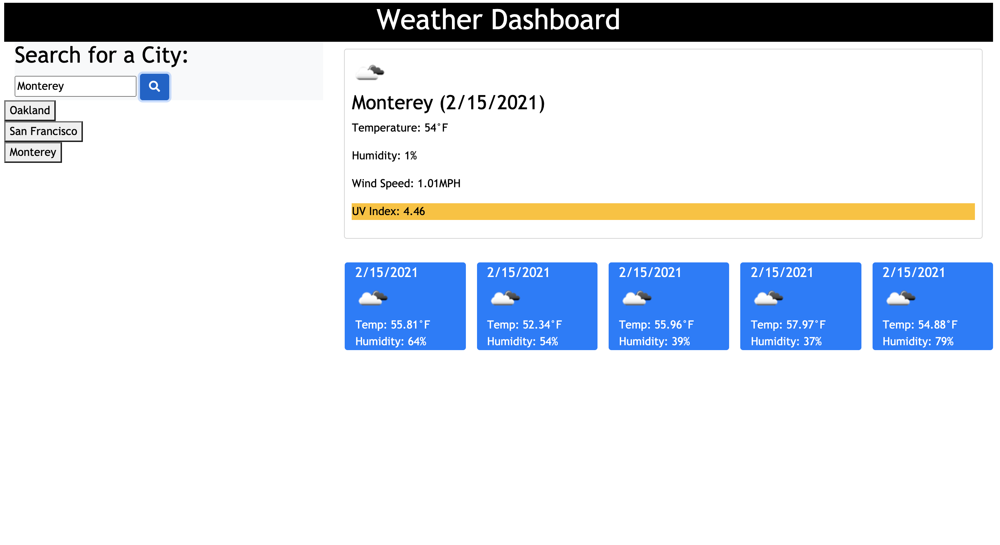

# Weather Dashboard 
 
  ## Description
  
  ### User Story
  AS A traveler  
  I WANT to see the weather outlook for multiple cities  
  SO THAT I can plan a trip accordingly 

  ## Table of Contents

  * [Usage](#usage)

  * [Screenshot](#screenshot)

  * [Contribution](#contribution)

  * [Questions](#questions)

  ## Usage

  As a traveler, I want to be able to easily look up the weather for the cities I will be visiting. When I search for a city I am presented with the current and future conditions for the city. I am also given the weather conditions, the temperature, the humidity, the wind speed, and the UV index. I am also presented with a 5-day forecast that displays the weather information for the next 5 days.

   

  I can see all cities I have searched displayed under the search bar. If I click back to a city, I am presented with the weather data again.

  ## Screenshot 

  
 

  ## Contribution 

  All contributions are welcome. Please visit the [issues](https://github.com/pmac16/weather-dashboard/issues) tab  to contribute.

  ## Questions

  If you have additional questions, please email me at priya.macpherson@gmail.com.

  Connect with me on GitHub! : [pmac16](https://github.com/pmac16)

### ©️Priya Macpherson

